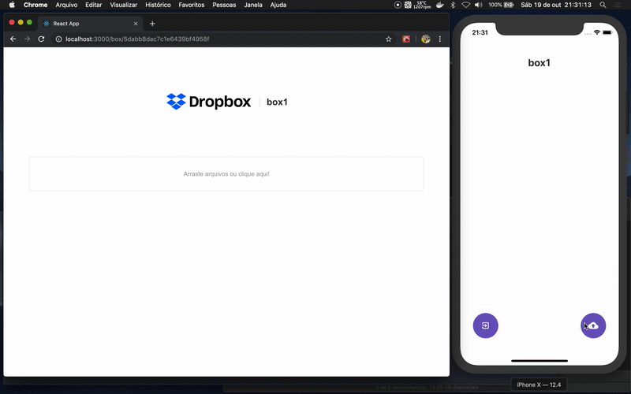

## Instalação

- Entre nas pastas back, front e mobile e de um npm install ou yarn para a instalação das dependencias.

- no backend entre: src/server.js e altere a linha do **mongoose.connect**
  - pode usar o docker para subir um container em mongo:

```
docker run --name mongodropbox -p 27017:27017 -d -t mongo
```

### No Backend e Frontend

```
yarn start
```

### No Mobile

```
react-native run-ios
```


